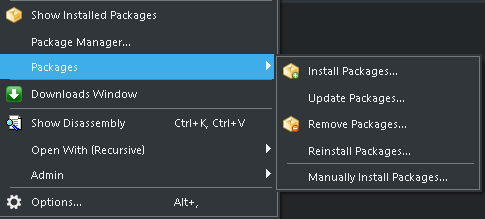

# CPU Support package for the intel SoC

This CPU Support package enables the development for the intel SoC microprocessor family using the [Crossworks development environment](https://rowley.co.uk/arm/index.htm) from Rowley. The package provides all needed data and information to enabled the Development Environment to compile and debug applications on the iMXRT microcontroller
This Includes:

- CMSIS-Specific Code Files
- Memory-Map-Files
- Register-Descriptions for debugging

## Build and Install

The Package is provided unpacked and has to be packed before it can be installed. For this open the Project File located in the root of the project with the Crossworks IDE (File IntelSoC.hzp). Then “compile" it like a normal project (Build -> Build iMXRT). This will create the CPU-Support package in the root-Folder of the project (-> iMXRT.hzq).
To install the new created package, go to Tools -> Packages -> Manually Install Packages and choose the new File.  
  

